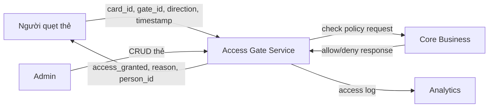

# Service Boundary

## 1. Tên Service
Access Gate Service

## 2. Bài toán Service giải quyết
Mô phỏng hệ thống kiểm soát ra/vào bằng thẻ RFID, mã sinh viên/nhân viên hoặc QR code. Service nhận sự kiện quẹt thẻ, xác thực người dùng, ghi log ra/vào, và phối hợp với Core Business để xác nhận chính sách truy cập trước khi cho phép qua cổng.

## 3. Actor
- **Người quẹt thẻ** (sinh viên, nhân viên): gửi sự kiện quẹt thẻ RFID/mã/QR tại cổng
- **Admin**: quản lý danh sách thẻ (thêm, tra cứu)
- **Core Business** (hệ thống ngoài): nhận request kiểm tra chính sách và trả kết quả allow/deny
- **Analytics** (hệ thống ngoài): tiêu thụ dữ liệu log ra/vào để tổng hợp KPI

## 4. Responsibility
- Nhận sự kiện quẹt thẻ hoặc nhập mã qua endpoint `/access-events`
- Kiểm tra thông tin thẻ: tồn tại, còn ở trạng thái active
- Ghi log mọi lượt ra/vào (card_id, gate_id, direction, timestamp, kết quả)
- Gửi sự kiện sang Core Business để xác nhận chính sách truy cập cuối cùng
- Cung cấp API CRUD quản lý thẻ cho admin

## 5. Out of scope
- Không tự quyết định chính sách truy cập phức tạp (giờ giới nghiêm, khu vực hạn chế) — thuộc trách nhiệm của Core Business
- Không gửi thông báo trực tiếp đến người dùng/bảo vệ — chỉ được kích hoạt gián tiếp thông qua Core Business
- Không tự tổng hợp báo cáo, thống kê, KPI — thuộc trách nhiệm của Analytics
- Không xử lý nhận diện khuôn mặt hoặc camera (thuộc AI Vision)

## 6. Input

| Field | Type | Required | Ý nghĩa |
|---|---|---|---|
| card_id | string | Yes | Mã định danh thẻ (RFID/mã SV/QR) |
| gate_id | string | Yes | Mã định danh cổng ra/vào |
| direction | string (IN/OUT) | Yes | Hướng di chuyển qua cổng |
| timestamp | datetime (ISO 8601) | Yes | Thời điểm quẹt thẻ |

## 7. Output

| Field | Type | Ý nghĩa |
|---|---|---|
| access_granted | boolean | Kết quả cho phép qua cổng hay không |
| reason | string | Lý do allow/deny (VD: "Valid student card", "Card not found") |
| person_id | string | Mã định danh người quẹt thẻ (VD: "SV001") |

## 8. Provider / Consumer

**Provider (Access Gate cung cấp dữ liệu cho):**
| Consumer | Dữ liệu cung cấp |
|---|---|
| Analytics | Dữ liệu log lượt ra/vào qua `GET /access-events` |

**Consumer (Access Gate gọi sang service khác):**
| Provider | Mục đích |
|---|---|
| Core Business | Gửi request xác nhận chính sách truy cập (`POST /policies/evaluate-access`) |

## 9. Upstream / Downstream
- **Upstream** (nguồn dữ liệu đầu vào): Người quẹt thẻ (qua thiết bị RFID/QR reader), Admin (qua giao diện quản trị)
- **Downstream** (bên bị ảnh hưởng nếu contract thay đổi): Core Business (nhận request đánh giá policy), Analytics (nhận dữ liệu log)

## 10. API dự kiến
| Method | Endpoint | Mục đích |
|---|---|---|
| POST | `/access-events` | Nhận sự kiện quẹt thẻ, kiểm tra, ghi log, trả kết quả |
| GET | `/access-events` | Lấy danh sách log ra/vào (cho Analytics) |
| GET | `/cards/{card_id}` | Lấy thông tin thẻ |
| POST | `/cards` | Thêm thẻ mới |
| GET | `/health` | Kiểm tra service còn sống |

## 11. Event dự kiến
- `access.logged` — phát ra mỗi khi ghi log thành công một lượt ra/vào, để Analytics có thể subscribe theo kiểu bất đồng bộ thay vì phải liên tục gọi `GET /access-events`
- `access.denied` — phát ra khi phát hiện truy cập bất thường, để Core Business có thể chủ động lắng nghe và quyết định gửi cảnh báo qua Notification

## 12. Boundary Diagram

## 13. Vấn đề cần đàm phán ở Buổi 2
1. Format request/response chính xác khi Access Gate gọi Core Business để xác nhận chính sách — cần thống nhất field names và cấu trúc JSON với nhóm Core Business
2. Access Gate cung cấp log cho Analytics theo kiểu đồng bộ (Analytics tự gọi `GET /access-events`) hay bất đồng bộ (Access Gate phát event qua message queue)?
3. Timeout xử lý khi Core Business phản hồi chậm hoặc không phản hồi — Access Gate nên deny mặc định hay allow tạm với cảnh báo?